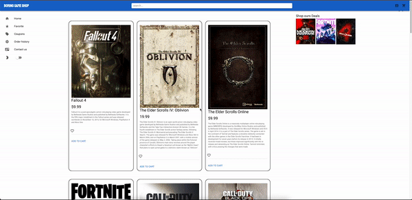

# Boring-Game-Shop

#### Resources

[Link to deployed site](https://boring-game-shop-9e632aaf5137.herokuapp.com/)


## Technology Used

- [npm](https://www.npmjs.com/)
- [JavaScript](https://developer.mozilla.org/en-US/docs/Web/JavaScript)

**BackEnd:**

- [@apollo/server](https://www.apollographql.com/docs/apollo-server/)
- [bcrypt](https://www.npmjs.com/package/bcrypt)
- [express](https://expressjs.com/)
- [graphql](https://graphql.org/)
- [jsonwebtoken](https://www.npmjs.com/package/jsonwebtoken)
- [mongoose](https://www.npmjs.com/package/mongoose)
- [Stripe API](https://stripe.com/docs)

**FrontEnd:**

- [@apollo/client](https://www.apollographql.com/docs/react/)
- [graphql](https://graphql.org/)
- [jwt-decode](https://www.npmjs.com/package/jwt-decode)
- [react](https://react.dev/)
- [react-dom](https://www.npmjs.com/package/react-dom)
- [react-router-dom](https://www.npmjs.com/package/react-router-dom)
- [vitest](https://vitest.dev/)
- [happy-dom](https://www.npmjs.com/package/happy-dom)
- [HTML](https://developer.mozilla.org/en-US/docs/Web/HTML)
- [CSS](https://developer.mozilla.org/en-US/docs/Web/CSS)
- [BootStrap](https://getbootstrap.com)
- [MUI](https://mui.com/)
- [TailWind](https://tailwindcss.com/)
- [Unsplash API](https://unsplash.com/developers)

### Description

Welcome to Boring Game Shop, where even the most mundane games get exciting! In an era where online businesses are flourishing. Boring Game Shop aims to bring a touch of excitement to the world of eCommerce by presenting a real-life application developed using the MERN Stack. The application is styled with Materialize UI, adding flair with emojis and ensuring a delightful user experience. For secure and seamless transactions, we've integrated Stripe for the checkout process.




#### Table of Contents

- [Installation](#installation)
- [Usage](#usage)
- [Highlighted Features](#highlighted-features)
- [Learning Points](#learning-points)
- [License](#license)
- [Badges](#badges)
- [Contributing](#contributing)
- [Authors](#authors)

---


#### Installation

- To install all dependencies, run: npm install
- To load the seeds into the database, run: npm run seed
- To start the server, run: npm run develop

---


### Usage
---

**Home Page**

The homepage provides users with a streamlined experience to enter the API index within the site.


---

**Login/Sign Up**

Existing users have the ability to log in and new users have the ability to sign up.


---


### Highlighted Features


**Secure User Password**

To secure user password we utilize Bcrypt npm package for harsh user password on creation and login 

```
// set up pre-save middleware to create password
userSchema.pre('save', async function(next) {
  if (this.isNew || this.isModified('password')) {
    const saltRounds = 10;
    this.password = await bcrypt.hash(this.password, saltRounds);
  }

  next();
});

// compare the incoming password with the hashed password
userSchema.methods.isCorrectPassword = async function(password) {
  console.log('this.password', this.password);
  console.log('password', password)
  return await bcrypt.compare(password, this.password);
};
```

---


**Data Persistent**

We want the shopper to have item saved in cart until checkout or delete from cart without having to readd to cart every time they close the window, to achieve this effect we utilize IndexDB

```
export function idbPromise(storeName, method, object) {
  return new Promise((resolve, reject) => {
    const request = window.indexedDB.open('shop-shop', 1);
    let db, tx, store;
    request.onupgradeneeded = function(e) {
      const db = request.result;
      db.createObjectStore('products', { keyPath: '_id' });
      db.createObjectStore('categories', { keyPath: '_id' });
      db.createObjectStore('cart', { keyPath: '_id' });
    };

    request.onerror = function(e) {
      console.log('There was an error');
    };

    request.onsuccess = function(e) {
      db = request.result;
      tx = db.transaction(storeName, 'readwrite');
      store = tx.objectStore(storeName);

      db.onerror = function(e) {
        console.log('error', e);
      };

      switch (method) {
        case 'put':
          if (!object._id) {
            console.error('Object must have an _id property: ', object);
            return;  
          }
          store.put(object);
          resolve(object);
          break;
        case 'get':
          const all = store.getAll();
          all.onsuccess = function() {
            resolve(all.result);
          };
          break;
        case 'delete':
          store.delete(object._id);
          break;
        default:
          console.log('No valid method');
          break;
      }

      tx.oncomplete = function() {
        db.close();
      };
    };
  });
}
```
---


**Payment Handling**

We didn't have to handle the payment, rather than it's stripe that does most of it for us, we just have to send stripe information that it needs.

```
    checkout: async (parent, args, context) => {
      const url = new URL(context.headers.referer).origin;
      await Order.create({ products: args.products.map(({ _id }) => _id) });
      // eslint-disable-next-line camelcase
      const line_items = [];

      // eslint-disable-next-line no-restricted-syntax
      for (const product of args.products) {
        line_items.push({
          price_data: {
            currency: 'usd',
            product_data: {
              name: product.name,
              description: product.description,
              images: [`${url}/images/${product.image}`]
            },
            unit_amount: product.price * 100,
          },
          quantity: product.purchaseQuantity ,
        });
      }

      const session = await stripe.checkout.sessions.create({
        payment_method_types: ['card'],
        line_items,
        mode: 'payment',
        success_url: `${url}/success?session_id={CHECKOUT_SESSION_ID}`,
        cancel_url: `${url}/`,
      });
      return { session: session.id };
    },
  },
```
---


### Learning Points

Building a E-commerce platform with MERN Stack and implemented transaction ability to a online web application

---


#### License

This project is licensed with MIT license

Link to License - [Website to MIT License](<(https://opensource.org/license/mit)>)

---


### Badges


## Authors:

Andrew Hall

- [Portfolio](#)
- [LinkedIn](#)
- [GitHub](#)

Anthony Nguyen

- [Portfolio](#)
- [LinkedIn](#)
- [GitHub](#)

Thai Nghiem

- [Portfolio](https://main--j-studio-rjs.netlify.app/)
- [LinkedIn](https://www.linkedin.com/in/thai-nghiem-319292267/)
- [GitHub](https://github.com/Truecoding4life)

Andy Zurek

- [Portfolio](https://clinquant-sundae-c9bd6e.netlify.app/)
- [LinkedIn](https://www.linkedin.com/in/andy-zurek-374bb9291/)
- [GitHub](https://github.com/AZurek17)
